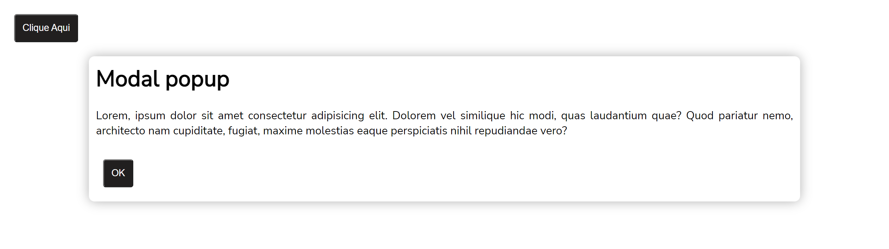

# Modal popup

Desenvolvido para aprendizado. Realizado modal (popup). 15/10/22

[🔗 Clique aqui para acessar] (https://michel-maia.github.io/Modal-popup/)

## 💻 Tecnologias

- HTML
- CSS
- Javascript

## Referência

- [Youtube] https://www.youtube.com/c/MaykBrito

- [mozilla] https://developer.mozilla.org/en-US/docs/Web/HTML/Element/dialog

